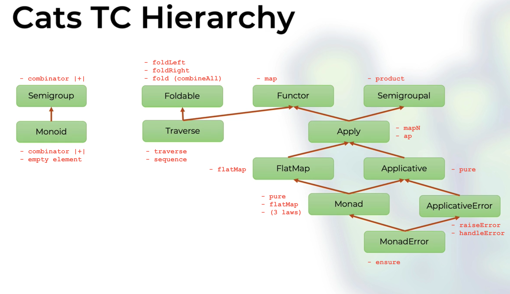

 
# Rock The JVM - Cats Course's Exercises

## Cats Type Classes Hierarchy

At the end of the course, you should have learned the following type classes hierarchy.
I try to annotate each type class with its characterizing methods.

The copyright of the above image is of the [RockTheJvm](https://rockthejvm.com/) site.

### `Applicative[F[_]]`

The type class `Applicative` implements a model of execution that allows us to execute a list of
function on the effect `F`, regardless the success or failure of each application.

In Cats, a well-known instance of the `Applicative` type class is the `Validated[E, A]` class. The
`E` type parameter represents the type of the error. Instead, the `A` type parameter represents the
type of right value.